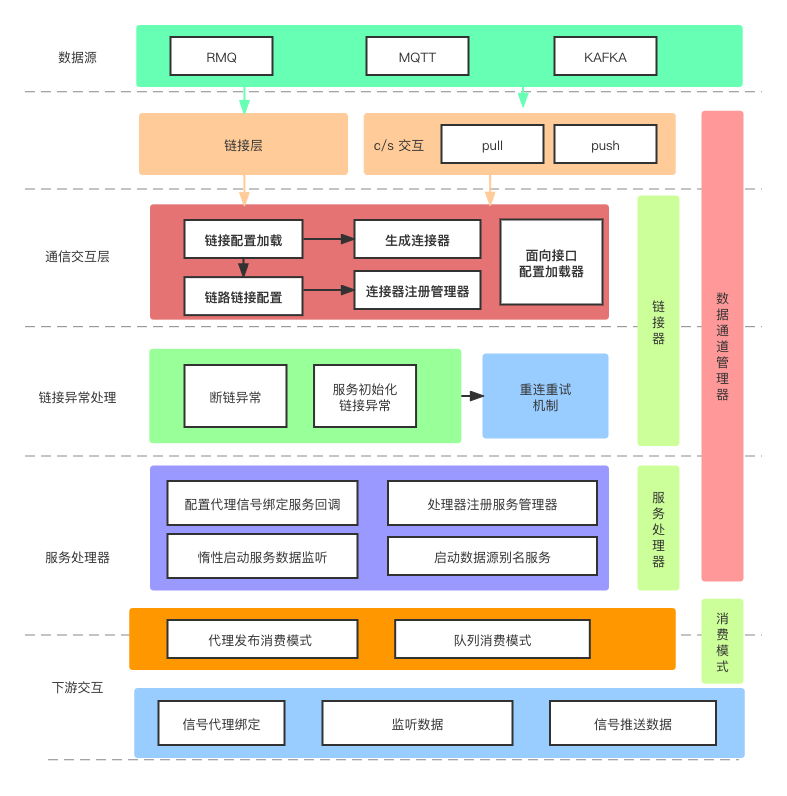

# PyDP-Core
## AMQSection 
#### Python Data Process Core Library

[TOC]
### rabbitmq 公用组件 

### 公共组件使用方法

##### 结构流程:



##### 配置示例
```yaml
server:                                                     # 服务链接配置
  host: 127.0.0.1
  port: 5672
  virtual_host: !!str /tc/test
  user: guest
  password: guest


interface_bind:                                               # 更具 PB 接口规范&Rabbimt设计规范配置定义
  ActStatus:                                                  # 定义接口结构
    bind_key:                                                 # 绑定键
      fmp.v1.k.state.ActStatus.#
    queue:                                                    # rabbitmq 消费队列
      fmp.v1.q.state.ActStatus.ad.{app_type}
    exchange:                                                 # rabbitmq 交换机
      fmp.v1.e.topic.state
    callback_agent:                                           # 回调信号绑定别名
      state_agent
    consumer_mode:                                            # 下游消费数据模式
      agent: true                                             # 信号代理开关
      queue: false                                            # 隔离消费队列开关
```


##### 调运简例
```python
# step 1： 导入类库
import AMQSection

class BSS:
    def __init__(self):
        #step 2：实例
        self.amq = AMQSection(config_dir="/Users/apple/Desktop/Trunk-Pro/PyDP-Core/configs",
                              maxsize=6666666)
        #step 3: 代理链接
        self.amq.signal_agent.state_agent.connect(self.act_state_callback)
        self.amq.signal_agent.order_agent.connect(self.act_orders_callback)
    
    #step 4: 自定义回调
    def act_orders_callback(self, **kwargs):
        data = kwargs.get("data")
        logger.info(f"source:{data.get('sender')}")
        print(kwargs)

    def act_state_callback(self, **kwargs):
        data = kwargs.get("data")
        logger.info(f"source:{data.get('sender')}")
        print(kwargs)

if __name__ == '__main__':

    bss = BSS()
    bss.amq.listening(["rmq_1","rmq"])
    #step 4.1: 隔离队列获取数据
    print(bss.amq.callback_queue.get())

    # todo rmq 消息发送
    rmq_client = bss.amq.get_client("rmq")
    rmq_client.publish_msg(
        data="hello",
        routing_key="fmp.v1.k.state.ActStatus.fms.A001",
        exchange="fmp.v1.e.topic.state",
        queue=""
    )

    # todo mqtt 消息发送
    mqtt_client = bss.amq.get_client("mqtt_1")
    mqtt_client.publish_msg(
        topic="fmp/state/ArtStatus/A001",
        qos=1,
        payload="Hi"
    )

```

## install

```
$ pip3 install git+http://git-rd.trunk.tech/tpg/common-module.git
```